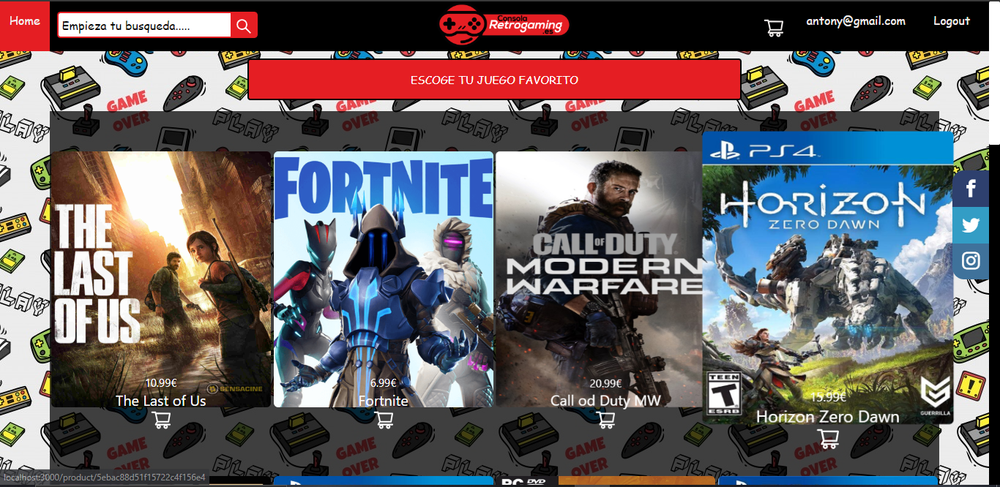
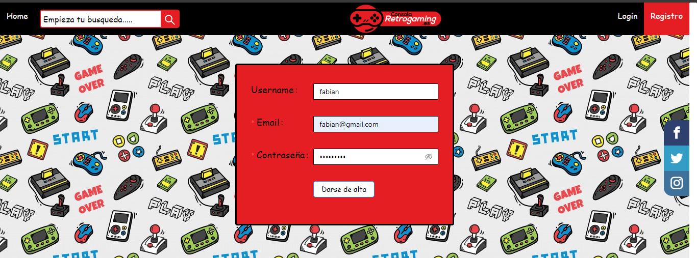
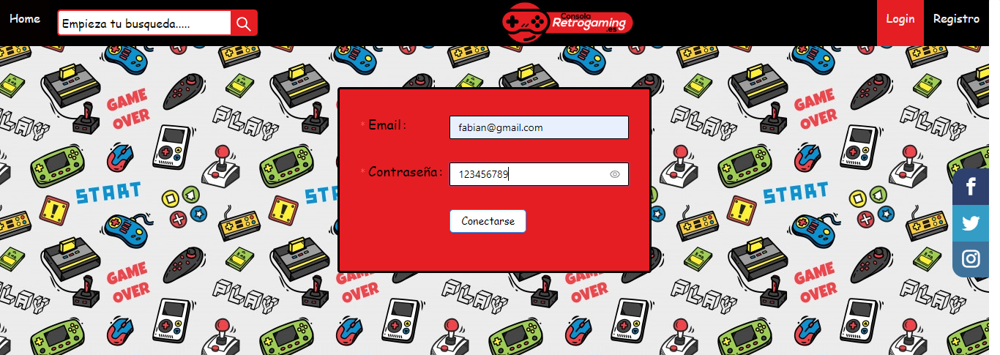
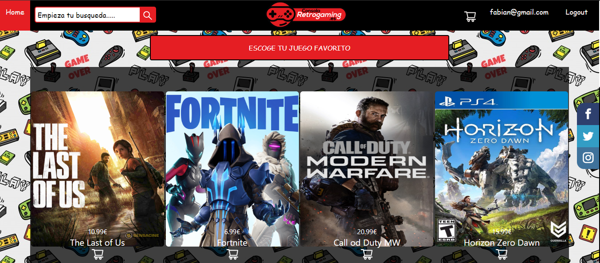
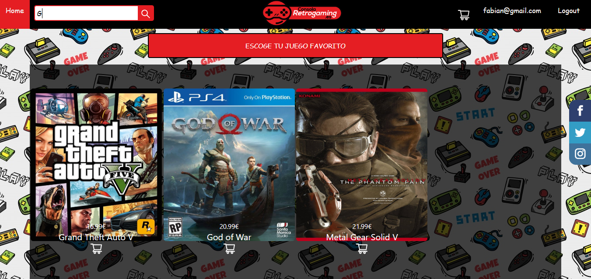
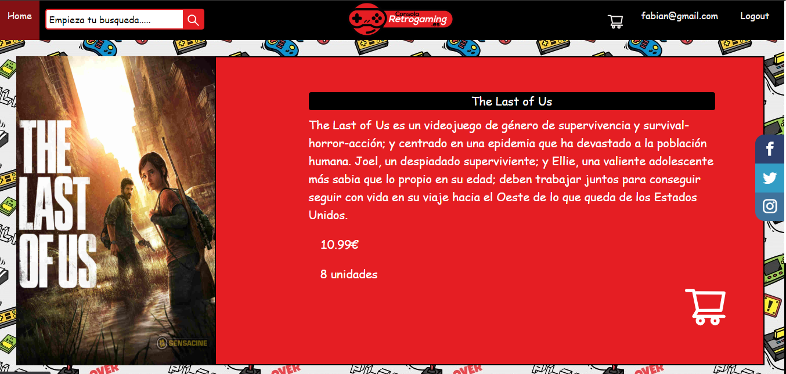
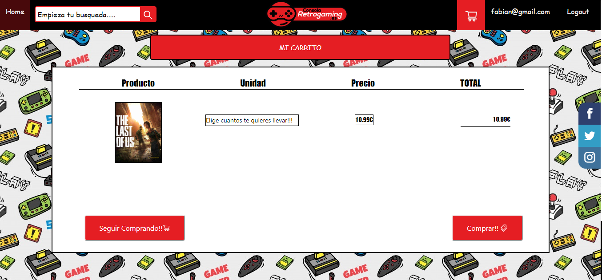

# PROYECTO-E-COMMERCE


### Este es mi e-commerce de videojuegos, acontinuación hare unas breves explicaciones de como funciona, los resquisitos, las tecnologias que hemos utilizamo y demas, espero que os guste, graciass._

## Pre-requisitos 📋

_¿Que cosas necesitas para instalar el software y como instalarlas?_

Necesitaremos una herramienta donde podremos trabajar , en el cual yo he utilizado Visual Studio Code, un servidor con MongoDB Y también en mi caso eh utilizado  robo 3T para manejar mis bases de datos pero eso es opcional ,  El proyecto es compatible para todas los sistemas operativos, y para todas las plataformas de internet.

## Instalación 🔧


_Empezamos con la instalación_

_El primer paso al descargar el repositorio, tenemos que hacer el comando de abajo para poder descargar todos los modulos que hemos utilizado y asi poder hacer funcionar el proyecto, importante entrar en cada carpeta y ejecutar el siguiente comando_

  

```
npm i
```

  

_Y para arrancar el backend y el fronted, lo haremos con el siguiente comando, lo mismo que antes situarnos en cada carpeta y ejecutar el siguiente comando_

```
npm start
```
_Y ahora os voy mostrar algunos aspectos de la pagina_

  

## Register

 _Esta es la pagina del registro en el cual ponemos nuestro username, nuestro correo y nuestra contraseña_
## Login

_Despues de habernos registrado con exito nos redigera al login donde debemos poner nuestro correo y contraseña con la que nos hemos registrado_
## Home

_Una vez nos hemos logueado bien no redigera a la home de nuestra pagina web, donde podemos ver todos los videjuegos que podemos comprar con los precios etc_
### BUSQUEDA

_En esta foto podemos ver como podemos buscar mediante el buscador el juego que queramos con solo escribir alguna letra que lleve nuestro juego nos lo muestra_
### DETALLE PRODUCTO

_Aqui podemos ver el juego con su descripcion con el precio y las unidades que quedan y la opcion de comprar, algo que debemos tener en cuenta que a al hora de darle al carrito si no estamos logueado o registrado no nos dejara comprar el producto en este caso el juego._


### CARRITO⌨️

_Aqui podemos ver como se nos ha añadido el juego al carrito, en el cual podemos elegir cuantas unidades queremos llevarnos y darle a comprar o seguir comprando_


## Construido con 🛠️

_En este proyecto hemos utilizado las siguientes tecnologias :_

  

*  REACT
*  EXPRESS
*  MONGODB
*  NODE.JS


  

## Autores ✒️

  

_Menciono a mis compañeros en cual estamos en el proyecto_

  


*  **Antony** - *Todo el proyecto* -(https://github.com/antony0110)


---

⌨️ con ❤️ por [Antony](https://github.com/antony0110)
